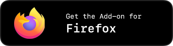

  


# Adaptive Tab Bar Colour

Changes the colour of Firefox theme to match the website’s appearance.

<a href="https://addons.mozilla.org/firefox/addon/adaptive-tab-bar-colour/" target="_blank">
	
</a>

<br>

## What Does the Add-on Do?

This add-on dynamically adjusts the Firefox theme to match the appearance of the website you are viewing, similar to the tab bar tinting feature in Safari on macOS.

   

<br>

## Works Well With

- [Dark Reader](https://addons.mozilla.org/firefox/addon/darkreader/)
- [Stylus](https://addons.mozilla.org/firefox/addon/styl-us/)
- [Dark Mode Website Switcher](https://addons.mozilla.org/firefox/addon/dark-mode-website-switcher/)

<br>

## Incompatible With

- [Adaptive Theme Creator](https://addons.mozilla.org/firefox/addon/adaptive-theme-creator/)
- [Chameleon Dynamic Theme](https://addons.mozilla.org/firefox/addon/chameleon-dynamic-theme-fixed/)
- [VivaldiFox](https://addons.mozilla.org/firefox/addon/vivaldifox/)
- [Envify](https://addons.mozilla.org/firefox/addon/envify/)
- Any other add-on that modifies the Firefox theme

<br>

## Removing the Shadow Beneath the Toolbar

To remove the thin shadow cast by web content onto the browser toolbar, navigate to Settings (`about:preferences`) and disable “Show sidebar” in the “Browser Layout” section. Alternatively, add the following code to your CSS theme:

```css
#tabbrowser-tabbox {
	box-shadow: none !important;
}
```

<details>
<summary>How to apply custom CSS</summary>

1. Type `about:config` in the address bar and press Enter.
2. Search for `toolkit.legacyUserProfileCustomizations.stylesheets` and set it to `true`.
3. Type `about:support` in the address bar.
4. Find “Profile Folder” and click the “Show in Finder” (macOS) or “Open Folder” (Windows/Linux) button.
5. Create a new folder named `chrome` in your profile directory.
6. Inside the `chrome` folder, create a text file named `userChrome.css`.
7. Paste the code above into `userChrome.css` and save the file.
8. Restart Firefox.

</details>

<br>

## Enabling Smooth Colour Transitions

Due to technical limitations, smooth colour transitions for the tab bar are not natively supported. However, you can enable this effect by adding the following code to your CSS theme (thanks to [@Moarram](https://github.com/Moarram/)):

```css
#navigator-toolbox,
#TabsToolbar,
#nav-bar,
#PersonalToolbar,
#sidebar-box,
.tab-background,
.urlbar-background,
findbar {
	transition:
		background-color 0.5s cubic-bezier(0, 0, 0, 1),
		border-color 0.5s cubic-bezier(0, 0, 0, 1) !important;
}
```

To enable smooth colour transitions in the Sidebery UI, add the following code to the Sidebery Style Editor (thanks to [@MaxHasBeenUsed](https://github.com/MaxHasBeenUsed/)):

```css
.Sidebar,
.bottom-space {
	transition: background-color 0.5s cubic-bezier(0, 0, 0, 1) !important;
}
```

<details>
<summary>How to apply custom CSS</summary>

1. Type `about:config` in the address bar and press Enter.
2. Search for `toolkit.legacyUserProfileCustomizations.stylesheets` and set it to `true`.
3. Type `about:support` in the address bar.
4. Find “Profile Folder” and click the “Show in Finder” (macOS) or “Open Folder” (Windows/Linux) button.
5. Create a new folder named `chrome` in your profile directory.
6. Inside the `chrome` folder, create a text file named `userChrome.css`.
7. Paste the code above into `userChrome.css` and save the file.
8. Restart Firefox.

</details>

<br>

## Compatibility with Third-Party CSS Themes

A third-party CSS theme works with Adaptive Tab Bar Colour (ATBC), as long as they use Firefox’s standard colour variables (e.g. `--lwt-accent-color` for the tab bar colour). [This](https://github.com/easonwong-de/Firefox-Adaptive-Sur-Theme) is an example of an ATBC-compatible CSS theme.

<br>

## Title Bar Buttons on Linux with GTK Theme

Firefox’s title bar buttons may revert to the Windows style. To prevent this, access “Advanced Preferences” (`about:config`) and set `widget.gtk.non-native-titlebar-buttons.enabled` to `false`. (Thanks to [@anselstetter](https://github.com/anselstetter/))

<br>

## Safety Reminder

Beware of malicious web UIs. It is important to distinguish between the browser UI and the web UI. For further information, please refer to [The Line of Death](https://textslashplain.com/2017/01/14/the-line-of-death/). (Thanks to [u/KazaHesto](https://www.reddit.com/user/KazaHesto/))
